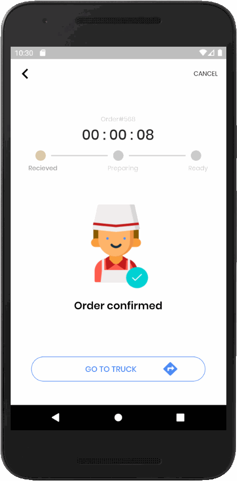

# 🍦 Flutter Food Delivery App "Order Tracking"

A Flutter app based on the design of the Food Delivery App "Order Tracking" *by Marwan Samir*, see more on: [Uplabs](https://www.uplabs.com/posts/food-delivery-app-order-tracking).

## Getting Started 🚀

- Clone the repo
- Install the dependicies
- Run it

## Preview

The app is based on Marwans design, see a preview of the Flutter app result:

## Support me

I really like to make as much (free) beautiful Flutter apps, so you get inspired!
Hence you can support me by:

⭐️ this repo if you like it.

Donate me of a cup of coffee ☕️:

Thank you in advanced 👍

## Other Flutter Apps

There are other example Apps made with flutter, see more on [Interestinate](https://interestinate.com).

Or the following repo's:
- An iOS focused Flutter App: [iSubscribe](https://github.com/LiveLikeCounter/Flutter-iSubscribe)
- A Package Manager App made with Flutter: [Package Manager](https://github.com/LiveLikeCounter/Flutter-Package-Manager)
- A To Do App based on Flutter: [To Do](https://github.com/LiveLikeCounter/Flutter-Todolist)
- A Paypal Redesign made in Flutter: [Paypal Redesign](https://github.com/LiveLikeCounter/Flutter-Paypal-Redesign)